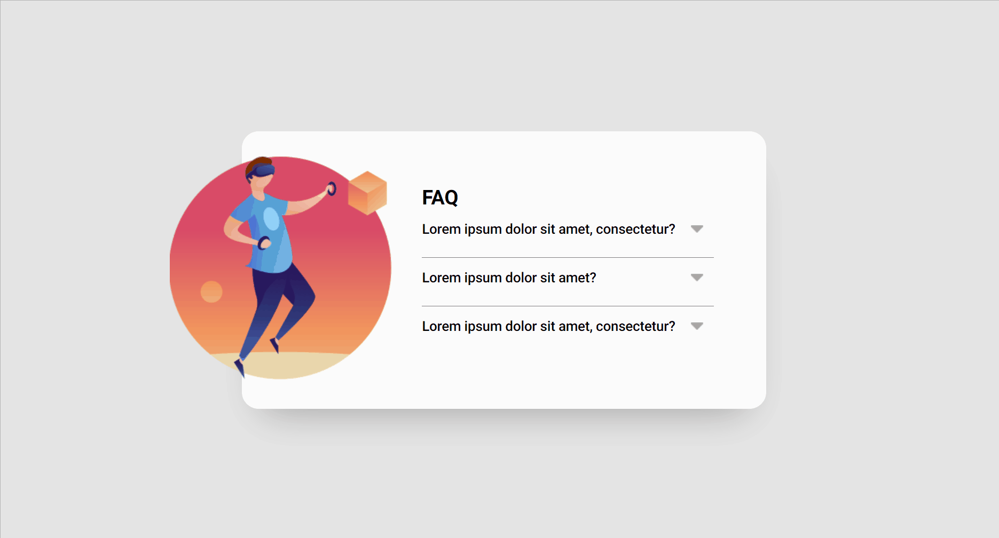
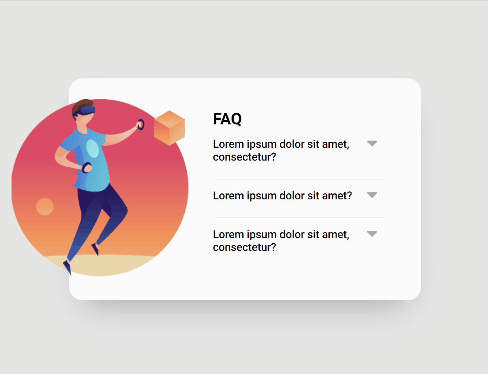
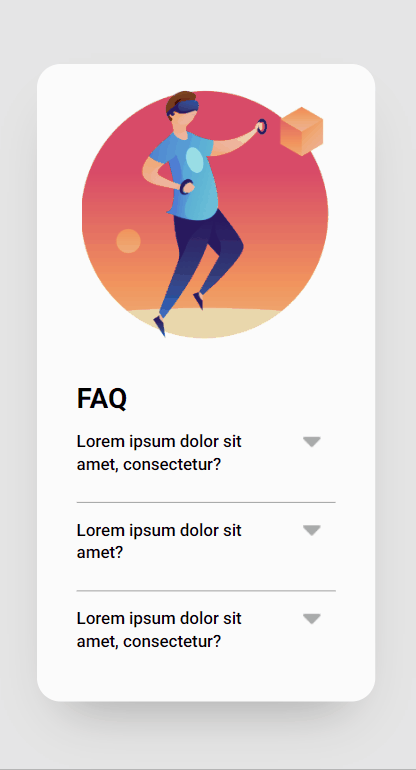

<h1>Acordeon built using HTML, CSS and JS</h1>

 This is a responsive acordeon component coded using only HTML, CSS and JS. I made this acordeon as an exercise for the course DevQuest by <a href="https://github.com/devemdobro" target="_blank">Dev em Dobro</a>.

<h2>Overview</h2>

<h3>The project</h3>

The project is a acordeon simulating a FAQ section. When the user clicks on a question, the answer to it appears and any other answer showing is hidden. There is a small CSS animation sliding down the answer as it appears on screen. 
 

<h3>Screen preview</h3>
<h4>Desktop</h4>

<h4>Tablet</h4>

<h4>Mobile</h4>

<h3>Links</h3>
<ul>
    <li>Live site URL: <a href="https://julianastahelin.github.io/acordeon-js-exercise/">https://julianastahelin.github.io/acordeon-js-exercise/</a></li>
</ul>

<h2>My process</h2>

<h3>Built with 👩🏽‍💻</h3> 
<ul>
    <li>HTML 5;</li>
    <li>CSS 3;</li>
    <li>JavaScript.
</ul>

<h3>What I practiced 💪🏽</h3>
<ul>
    <li>Using forEach in JS to iterate;</li>
    <li>Using CSS keyframes for animation.</li>
    <li>Using CSS media queries for responsiveness.</li>
</ul>